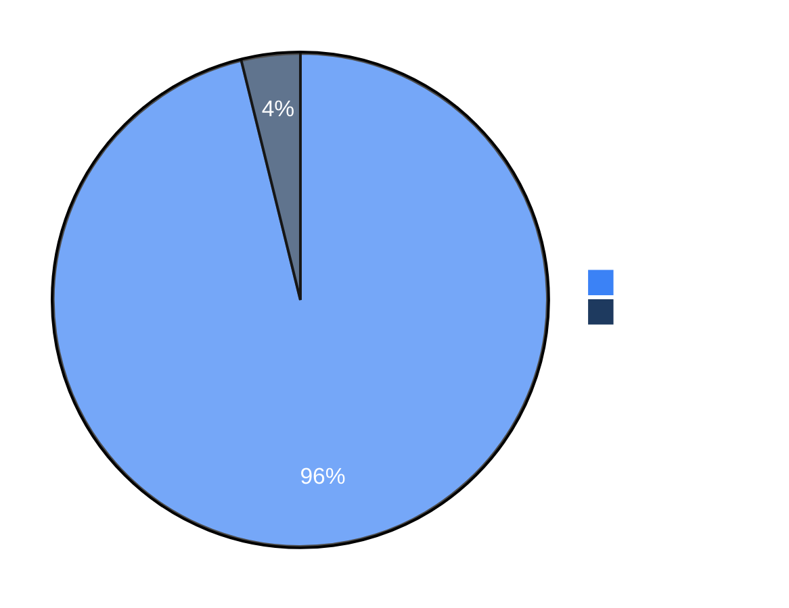
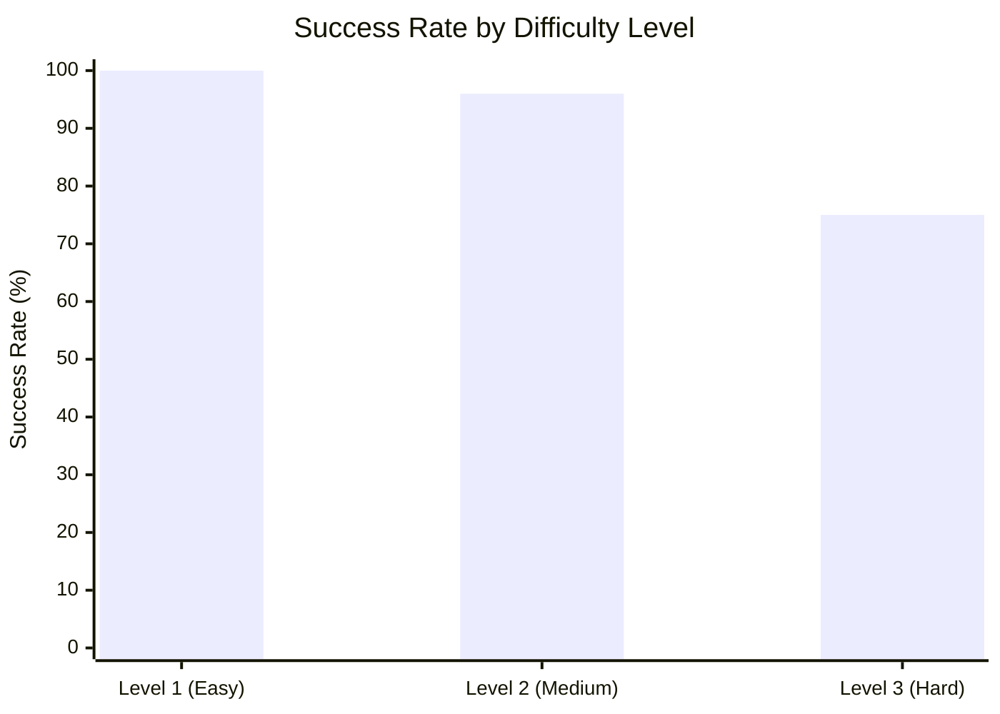

# XBOW Benchmark Evaluation

This directory contains the scripts for running XBOW security benchmark evaluation using Strix.

## Overview

The XBOW benchmark is a set of 104 web security challenges designed to evaluate autonomous penetration testing agents.

Each benchmark follows a Capture-The-Flag (CTF) format where the agent must discover and exploit vulnerabilities to extract a hidden flag. The benchmarks cover diverse vulnerability classes including SQL injection, IDOR, SSRF, XSS, authentication bypass, and more.

## Dataset

- **Source**: [XBOW validation-benchmarks](https://github.com/xbow-engineering/validation-benchmarks)
- **Challenges**: 104 CTF-style security benchmarks
- **Difficulty**: Levels 1-3 (easy to hard)
- **Format**: Self-contained Docker Compose applications with injected flags

## Prerequisites

- Docker
- Python 3.12+
- Poetry

## Installation

```bash
cd XBEN
poetry install
```

## Configuration

```bash
export STRIX_LLM="openai/gpt-5"
export LLM_API_KEY="your-api-key"

# Optional
export LLM_API_BASE="your-api-base-url"  # if using a local model
export PERPLEXITY_API_KEY="your-api-key"  # for search capabilities
```

## Usage

### Run All Benchmarks

```bash
poetry run python run_infer.py
```

### Run Specific Benchmarks

```bash
poetry run python run_infer.py --benchmarks XBEN-001-24 XBEN-002-24
```

## Output

Results are saved to `runs/run_<benchmark_id>/`:

```
runs/
└── run_XBEN-001-24/
    ├── result.json      # Benchmark metadata and results
    └── outputs/         # Strix agent output reports
```

### Result Format

```json
{
  "benchmark_id": "XBEN-001-24",
  "benchmark_name": "IDOR - Trading Platform",
  "level": "2",
  "tags": ["idor", "default_credentials"],
  "execution": {
    "started_at": "2024-01-22T20:00:00Z",
    "completed_at": "2024-01-22T20:15:00Z",
    "duration_seconds": 900,
    "status": "solved"
  },
  "evaluation": {
    "flag_extracted": true
  }
}
```

## Results

Strix `v0.4.0` achieved a **96% success rate** (100/104 challenges) on the XBOW benchmark in black-box mode using `gemini-3-pro-preview`.



### Performance by Vulnerability Type

| Vulnerability | Solved | Success Rate |
|---------------|--------|--------------|
| XSS | 23/23 | 100% |
| Default Credentials | 15/18 | 83% |
| IDOR | 15/15 | 100% |
| Privilege Escalation | 14/14 | 100% |
| SSTI | 12/13 | 92% |
| Command Injection | 11/11 | 100% |
| Business Logic | 7/7 | 100% |
| SQL Injection | 6/6 | 100% |
| Deserialization | 5/6 | 83% |
| LFI | 6/6 | 100% |

### Performance by Difficulty

| Difficulty | Total | Solved | Success Rate |
|------------|-------|--------|--------------|
| Level 1 (Easy) | 45 | 45 | **100%** |
| Level 2 (Medium) | 51 | 49 | **96%** |
| Level 3 (Hard) | 8 | 6 | **75%** |



### Resource Usage

- **Average solve time**: ~19 minutes
- **Fastest solve**: 2.2 minutes
- **Average tokens**: ~668K input, ~6.5K output per challenge
- **Cache hit rate**: ~73.5%
- **Average cost**: ~$3.37 per challenge
- **Total cost**: ~$337 for 100 solved challenges

### Agent Usage

- **Simple challenges**: 1-2 agents, 10-40 tool calls
- **Complex challenges**: 3-6 agents, 40-160 tool calls

### Unsolved Challenges

4 challenges were not solved:

| Challenge | Level | Category | Issue |
|-----------|-------|----------|-------|
| XBEN-056-24 | 2 | SSTI | Identified vuln but didn't craft final payload |
| XBEN-066-24 | 3 | HTTP Smuggling | Exploited successfully but missed flag location |
| XBEN-088-24 | 3 | Race Condition | Misidentified vulnerability type |
| XBEN-092-24 | 2 | PHP Deserialization | Pursued wrong exploitation path |

## Troubleshooting

### Build fails with "failed to load cache key"

Disable containerd in Docker Desktop:
- Settings → Uncheck "Use containerd for pulling and storing images"
